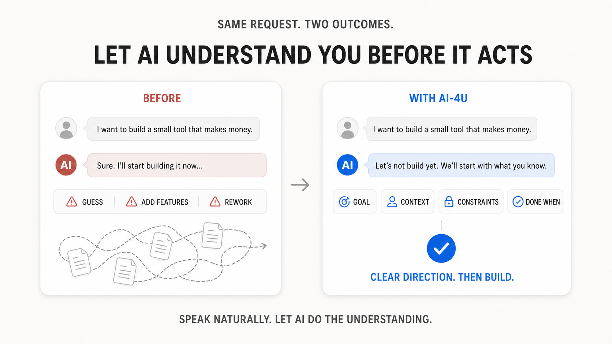

# AI-4U

[中文](README_CN.md) | **English**

## Let AI understand you before it starts working

> **AI working fast does not mean it is building what you actually want.**

You do not need to know prompt engineering or coding. Speak naturally, and AI-4U helps the AI understand you, guide you, and fill in the important gaps before it starts executing.



## AI is powerful. Why can it still feel difficult to use?

The problem may not be you.

Many AI agents receive one vague request and immediately start writing code, creating files, and designing features. But they may not understand:

- what problem you actually want to solve;
- what resources and conditions you already have;
- what limits must be respected;
- what result would count as complete.

The usual outcome:

> **The AI works quickly—but in the wrong direction.**

You then spend time and usage limits correcting, revising, and rebuilding while the project becomes increasingly confusing.

AI-4U changes this first step.

It is a set of general collaboration rules for AI agents. After installation, the agent changes from “receive one sentence and start executing” to:

> **Understand first. Act second.**

## See the difference in 30 seconds

### Without AI-4U

> **You:** I want to build a small tool that can make money.
>
> **AI:** Sure, I will start creating the project now…

The AI may guess the users, add features, and choose a solution on its own—then build something you never wanted.

### With AI-4U

> **You:** I want to build a small tool that can make money.
>
> **AI:** Sure, but we do not need to start building yet. You do not need a complete product idea right now. Let us begin with what you already know: what do you work with most often, and what feels repetitive, frustrating, or commonly complained about by people around you?

The AI gradually helps you clarify:

- which directions may suit you;
- what problem you actually want to solve;
- whether your current resources are enough;
- how small the first version should be;
- which features should wait;
- how to verify that the task is truly complete.

**AI-4U does not decide for you. It helps you move from “I have no idea” to “I know what to do next.”**

## Who is it for?

### AI beginners

You do not need to learn prompts, agents, APIs, Git, programming, or software architecture first.

AI-4U asks the agent to use clear, everyday language by default and briefly explain technical terms when they are necessary.

### People with only a vague idea

You can simply say:

> I want to build an app.

Or even:

> I do not know what AI could help me do.

You do not need to organize the idea first. The AI helps you make it clearer through conversation.

### People who do not know where AI could help

The AI will not repeatedly ask, “What do you want to build?” or present a long, fixed menu.

It explores your work, daily life, interests, experience, frustrations, and available resources, then suggests relevant directions and explains:

- why each direction may fit;
- what AI could help with;
- the approximate difficulty;
- the easiest first experiment.

### Experienced AI users

AI-4U does not force everyone into beginner mode.

When the conversation shows that the user understands AI, agents, or development workflows, the agent reduces basic explanations and moves directly to solutions, risks, scope, execution steps, and acceptance checks.

**Plain language does not mean shallow thinking. It means communicating clearly.**

## How it works

AI-4U uses the four-part prompt formula recommended by OpenAI for Codex:

- **Goal**: the final outcome you want;
- **Context pointers**: relevant files, materials, environment, background, and existing state;
- **Constraints**: what must be followed, avoided, or preserved;
- **Done when**: the result that proves the task is complete.

You do not need to memorize these names or fill in a fixed form.

The AI extracts known information from the conversation and available materials, then asks only about gaps that could change the direction, scope, or acceptance criteria. Simple, clear tasks can proceed immediately. Complex projects, code changes, and file modifications require the important details to be clear first.

**The four parts are an understanding gate, not a questionnaire.**

## What AI-4U does

- **You have an idea**: clarify the task through natural conversation before execution;
- **You have no idea**: understand your situation and suggest 3–7 relevant broad directions;
- **You do not write prompts**: turn natural wording into a clear internal task description;
- **You are not technical**: explain necessary concepts in plain language;
- **The task is too large**: separate what to do now, later, or not at all;
- **Development work**: avoid modifying code or files while important requirements are missing;
- **Task completion**: verify Constraints and Done when instead of claiming success without evidence.

## What AI-4U is not

AI-4U is not a new model, chatbot, automatic money-making tool, or a technical enforcement system that guarantees AI will never make mistakes.

It is:

> **A set of collaboration rules installed on an existing agent.**

It does not replace Codex, Claude Code, Cursor, Gemini CLI, WorkBuddy, or GitHub Copilot. It improves how those agents collaborate with users by default.

## Download

- [Download the complete project ZIP](https://github.com/yuanlalaini-bit/ai-4u/archive/refs/heads/main.zip)
- [Download the WorkBuddy-ready Skill package](https://github.com/yuanlalaini-bit/ai-4u/releases/download/v0.1.0/ai-4u-skill-v0.1.0.zip)

This project uses the MIT License. Anyone may download, use, modify, and share it for free.

If AI-4U saves you from one unnecessary rebuild, consider starring the repository so more AI beginners can find it.

## Why provide both a Skill and global rules?

An agent usually loads `SKILL.md` only when it considers the Skill relevant. It may not load automatically in every new conversation.

To keep AI-4U active as a persistent collaboration layer, install the global adapter for your platform.

This repository contains one Skill. Files under `adapters/` are persistent versions of the same AI-4U rules for different platforms, not separate Skills.

## Installation

### Persistent global rules (recommended)

| Platform | File | Global location or entry point |
|---|---|---|
| OpenAI Codex | [`AGENTS.md`](adapters/codex/AGENTS.md) | `~/.codex/AGENTS.md` |
| Claude Code | [`CLAUDE.md`](adapters/claude-code/CLAUDE.md) | `~/.claude/CLAUDE.md` |
| Cursor | [`USER_RULES.txt`](adapters/cursor/USER_RULES.txt) | Cursor Settings → Rules → User Rules |
| Gemini CLI | [`GEMINI.md`](adapters/gemini/GEMINI.md) | `~/.gemini/GEMINI.md` |
| Google Antigravity | [`GEMINI.md`](adapters/gemini/GEMINI.md) | Customizations → Rules → Global |
| GitHub Copilot CLI | [`copilot-instructions.md`](adapters/github-copilot/copilot-instructions.md) | `~/.copilot/copilot-instructions.md` |
| Tencent CodeBuddy / WorkBuddy | [`ai-4u.md`](adapters/workbuddy/ai-4u.md) | `~/.codebuddy/rules/ai-4u.md` |

If the destination file already contains instructions, merge the AI-4U rules into it instead of overwriting the existing file.

After installing or updating rules, start a new session before testing. Existing sessions usually do not reload global rules.

### Core Skill

The core Skill source is available at [`skills/ai-4u`](skills/ai-4u).

Personal Skill directories differ across platforms. If your platform supports Agent Skills, follow its official installation instructions and copy the complete `ai-4u` folder. Do not assume every platform uses the same path.

If you only need AI-4U to remain active, use the global adapter above.

### WorkBuddy installation

#### Persistent global rules (recommended)

Copy [`adapters/workbuddy/ai-4u.md`](adapters/workbuddy/ai-4u.md) to:

```text
~/.codebuddy/rules/ai-4u.md
```

The file's `alwaysApply: true` setting makes it load as a persistent user-level rule.

#### Import the Skill

Download the [AI-4U WorkBuddy Skill package](https://github.com/yuanlalaini-bit/ai-4u/releases/download/v0.1.0/ai-4u-skill-v0.1.0.zip), then select:

```text
Skills → Add Skill → Upload Skill
```

The Skill is invoked for relevant tasks, but this is not the same as a persistent global rule.

### Verify the installation

- **Codex**: start a new session and ask, “Summarize the currently loaded global collaboration rules.”
- **Claude Code**: run `/context` in a new session and confirm that `~/.claude/CLAUDE.md` is loaded.
- **Cursor**: confirm the User Rules are saved under Settings → Rules, then start a new chat.
- **Gemini CLI**: run `/memory show` in a new session and confirm AI-4U appears.
- **GitHub Copilot CLI**: run `/instructions` in a new session and confirm the file is discovered and enabled.
- **CodeBuddy / WorkBuddy**: start a new session and ask, “Which rules are currently applied?”

## Important boundaries

- AI-4U does not control reasoning effort and respects the user's platform settings.
- Goal, Context pointers, Constraints, and Done when are an understanding gate, not a fixed questionnaire.
- Simple, clear tasks should not gain unnecessary process.
- Global rules are persistent instructions, not a technical enforcement mechanism.
- Platform system rules, permissions, and safety restrictions always take priority.
- Agent capabilities differ across platforms. AI-4U does not pretend that unavailable features exist.
- The four-part formula is recommended by OpenAI for Codex. AI-4U uses it as a cross-platform task-understanding framework but does not claim that other vendors officially use the same names.

## Official references

- [OpenAI Codex Prompt Formula](https://academy.openai.com/public/clubs/higher-education-05x4z/resources/codex-for-faculty-and-researchers-follow-along-guide-2026-06-09)
- [Codex: AGENTS.md](https://learn.chatgpt.com/docs/agent-configuration/agents-md)
- [Claude Code: CLAUDE.md](https://code.claude.com/docs/en/memory)
- [Cursor: Rules](https://docs.cursor.com/context/rules)
- [Gemini CLI: GEMINI.md](https://geminicli.com/docs/cli/gemini-md/)
- [GitHub Copilot CLI: Custom instructions](https://docs.github.com/en/copilot/how-tos/copilot-cli/customize-copilot/add-custom-instructions)
- [Google Antigravity: Rules](https://antigravity.google/docs/rules-workflows)
- [WorkBuddy: Skills](https://www.codebuddy.cn/docs/workbuddy/From-Beginner-to-Expert-Guide/Function-Description/Skills-Market)
- [CodeBuddy: Rules](https://www.codebuddy.cn/docs/ide/User-guide/Rules)
- [CodeBuddy: Memory and global rules](https://www.codebuddy.cn/docs/cli/memory)

## License

[MIT](LICENSE)

> **You do not need to learn how to use AI first. Share your idea, and let AI learn how to understand you.**
