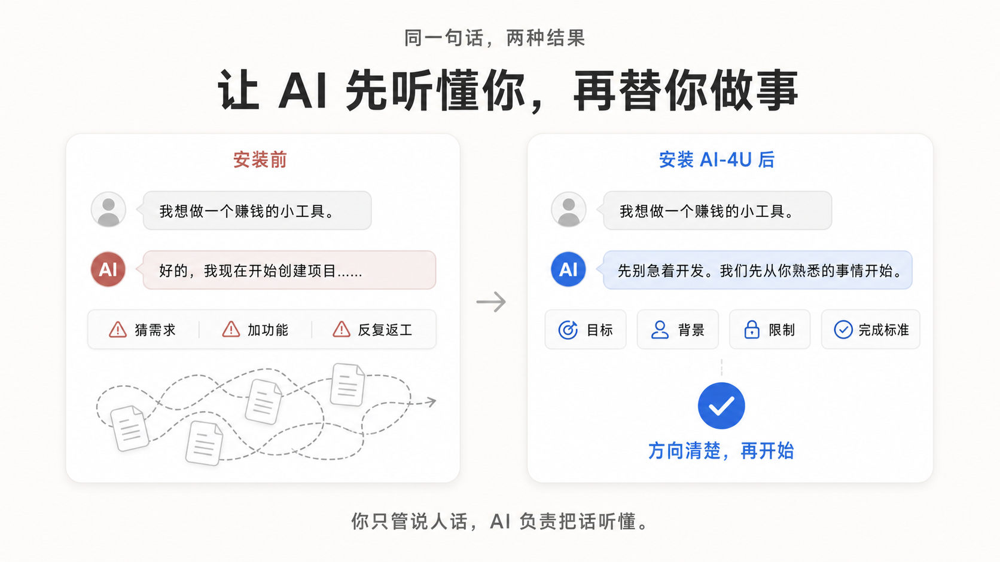

# AI-4U

**中文** | [English](README.md)

## 让 AI 先听懂你，再替你做事

> **AI 做得很快，不代表它做的是你想要的。**

你不需要会写提示词，也不需要懂代码。你只管说人话，AI-4U 会让 AI 先理解、引导和补全需求，再开始执行。



## AI 很强，为什么你还是用不好？

问题可能不在你。

很多 AI Agent 收到一句模糊需求后，就会立刻开始写代码、创建文件、设计功能。可它可能根本没有弄清楚：

- 你真正想解决什么问题；
- 你现在有什么条件；
- 有哪些限制不能违反；
- 做到什么程度才算完成。

结果往往是：

> **AI 做得很快，却做错了方向。**

然后你只能不断补充、修改、推倒重来。时间和额度消耗了，项目却越来越乱。

AI-4U 改变的就是这一步。

它是一套面向 AI Agent 的通用协作规则。安装后，Agent 会从“收到一句话就开始执行”，变成：

> **先听懂，再动手。**

## 30 秒看懂区别

### 没有 AI-4U

> **你：** 我想做一个能赚钱的小工具。
>
> **AI：** 好的，我现在开始创建项目……

接下来，AI 可能自己猜用户、加功能、选方案，最后做出一个并不是你想要的东西。

### 使用 AI-4U

> **你：** 我想做一个能赚钱的小工具。
>
> **AI：** 可以，先不用急着开发。你不需要现在就想好具体产品。我们可以先从你熟悉的事情开始：你平时最常接触什么？有哪些事情让你觉得麻烦、重复，或者身边的人经常抱怨？

AI 会逐渐帮你弄清楚：

- 什么方向更适合你；
- 你真正想解决什么；
- 现有条件是否支持；
- 第一版应该做多大；
- 哪些功能现在不该做；
- 怎样判断任务真的完成。

**AI-4U 不替你决定。它帮助你从“我不知道”走到“我知道下一步该做什么”。**

## 它适合谁

### AI 新手

你不需要提前学会提示词、Agent、API、Git、编程或软件架构。

AI-4U 默认要求 Agent 使用清楚的大白话；必须出现专业术语时，顺手解释它是什么意思。

### 脑中只有模糊想法的人

你可以只说：

> 我想做一个 App。

甚至：

> 我不知道 AI 能帮我做什么。

你不需要先把想法整理完整，AI 会主动帮你慢慢说清楚。

### 不知道该用 AI 做什么的人

AI 不会反复追问“你想做什么”，也不会丢给你一整页固定菜单。

它会从你的工作、生活、兴趣、经验、烦恼和已有资源出发，动态推荐可能适合的方向，并说明：

- 为什么可能适合你；
- AI 大概能帮什么；
- 实现难度如何；
- 最容易验证的第一步是什么。

### 已经熟悉 AI 的用户

AI-4U 不会强迫所有人进入“小白教学模式”。

当上下文表明用户已经熟悉 AI、Agent 或开发流程时，AI 会减少基础解释，直接讨论方案、风险、范围、执行步骤和验收方式。

**大白话不等于低水平。它要求的是表达清楚，而不是把专业内容说浅。**

## 它是怎样工作的

AI-4U 使用 OpenAI 为 Codex 推荐的四部分任务公式：

- **Goal**：最终想达到什么结果；
- **Context pointers**：相关文件、资料、环境、背景和已有状态；
- **Constraints**：必须遵守、避免或保留什么；
- **Done when**：达到什么结果才算真正完成。

你不需要记住这些名称，也不需要按固定格式填写。

AI 会从对话和已有资料中提取已知信息，只补问真正会影响方向、范围或验收结果的缺口。简单且明确的任务可以直接执行；复杂项目、代码开发和文件修改，则先把关键要求弄清楚。

**这四部分是理解门槛，不是固定问卷。**

## AI-4U 会做什么

- **有想法**：通过自然交流补全任务，再开始执行；
- **没想法**：了解你的情况，动态推荐 3–7 个大方向；
- **不会写提示词**：在内部把自然表达整理成清晰任务；
- **不懂技术**：用大白话解释必要概念；
- **任务太大**：帮你区分现在要做、暂时不做和以后再做；
- **开发任务**：关键要求不足时，不直接修改代码或文件；
- **完成任务**：按 Constraints 和 Done when 验证，不虚报完成。

## AI-4U 不是什么

AI-4U 不是新的大模型、聊天机器人、自动赚钱工具，也不是保证 AI 永远不出错的技术拦截器。

它是：

> **安装在现有 Agent 上的一套协作规则。**

它不会替换 Codex、Claude Code、Cursor、Gemini CLI、WorkBuddy 或 GitHub Copilot，只会改善这些 Agent 与用户协作时的默认习惯。

## 下载

- [下载完整项目 ZIP](https://github.com/yuanlalaini-bit/ai-4u/archive/refs/heads/main.zip)
- [下载可直接导入 WorkBuddy 的 Skill 包](https://github.com/yuanlalaini-bit/ai-4u/releases/download/v0.1.0/ai-4u-skill-v0.1.0.zip)

本项目采用 MIT 许可证，任何人都可以免费下载、使用、修改和分享。

如果 AI-4U 帮你少走了一次弯路，欢迎为仓库点一个 Star，让更多 AI 新手看到它。

## 为什么同时提供 Skill 和全局规则

`SKILL.md` 通常由 Agent 在相关任务中按需加载，不能保证每个新对话都会自动生效。

要让 AI-4U 持续作为基础协作规则，推荐安装对应平台的全局适配文件。

本仓库只有一个 Skill；`adapters/` 只是同一套规则在不同平台上的常驻版本，不是多个 Skill。

## 安装

### 全局常驻规则（推荐）

| 平台 | 使用文件 | 全局位置或入口 |
|---|---|---|
| OpenAI Codex | [`AGENTS.md`](adapters/codex/AGENTS.md) | `~/.codex/AGENTS.md` |
| Claude Code | [`CLAUDE.md`](adapters/claude-code/CLAUDE.md) | `~/.claude/CLAUDE.md` |
| Cursor | [`USER_RULES.txt`](adapters/cursor/USER_RULES.txt) | Cursor Settings → Rules → User Rules |
| Gemini CLI | [`GEMINI.md`](adapters/gemini/GEMINI.md) | `~/.gemini/GEMINI.md` |
| Google Antigravity | [`GEMINI.md`](adapters/gemini/GEMINI.md) | Customizations → Rules → Global |
| GitHub Copilot CLI | [`copilot-instructions.md`](adapters/github-copilot/copilot-instructions.md) | `~/.copilot/copilot-instructions.md` |
| 腾讯 CodeBuddy / WorkBuddy | [`ai-4u.md`](adapters/workbuddy/ai-4u.md) | `~/.codebuddy/rules/ai-4u.md` |

如果目标文件已有内容，请合并 AI-4U 规则，不要直接覆盖原文件。

安装或更新规则后，请新建会话再验证；已经打开的旧会话通常不会重新载入全局规则。

### 核心 Skill

核心 Skill 源码位于 [`skills/ai-4u`](skills/ai-4u)。

不同平台的个人 Skill 目录并不相同。平台支持 Agent Skills 时，请按该平台的官方安装方式放入完整的 `ai-4u` 文件夹，不要假设所有平台使用同一路径。

只想让 AI-4U 持续生效时，直接使用上方的全局适配文件即可。

### WorkBuddy 安装

#### 全局常驻规则（推荐）

将 [`adapters/workbuddy/ai-4u.md`](adapters/workbuddy/ai-4u.md) 复制到：

```text
~/.codebuddy/rules/ai-4u.md
```

文件中的 `alwaysApply: true` 会让规则作为用户级规则始终加载。

#### 导入 Skill

下载 [AI-4U WorkBuddy Skill 包](https://github.com/yuanlalaini-bit/ai-4u/releases/download/v0.1.0/ai-4u-skill-v0.1.0.zip)，然后在 WorkBuddy 中选择：

```text
技能 → 添加技能 → 上传技能
```

Skill 会在相关任务中调用，但不等同于全局常驻规则。

### 安装后怎样确认

- **Codex**：新建会话，询问“请概括当前加载的全局协作规则”；
- **Claude Code**：新建会话后运行 `/context`，确认加载了 `~/.claude/CLAUDE.md`；
- **Cursor**：在 Settings → Rules 中确认 User Rules 已保存，再新建聊天；
- **Gemini CLI**：新建会话后运行 `/memory show`，确认出现 AI-4U；
- **GitHub Copilot CLI**：新建会话后运行 `/instructions`，确认文件已被发现并启用；
- **CodeBuddy / WorkBuddy**：新建会话，询问“当前应用了哪些规则？”。

## 重要边界

- AI-4U 不控制推理程度，完全尊重用户在当前平台中的设置；
- Goal、Context pointers、Constraints、Done when 是理解门槛，不是固定问卷；
- 简单且明确的任务不需要制造额外流程；
- 全局规则属于持久提示，不是技术上的强制拦截器；
- 平台系统规则、权限限制和安全规则始终优先；
- 不同 Agent 平台的实际能力可能不同，AI-4U 不会假装拥有平台没有提供的功能；
- 四部分公式来自 OpenAI 对 Codex 的推荐；AI-4U 将其用作跨平台任务理解框架，但不声称其他厂商也使用完全相同的官方名称。

## 官方依据

- [OpenAI Codex Prompt Formula](https://academy.openai.com/public/clubs/higher-education-05x4z/resources/codex-for-faculty-and-researchers-follow-along-guide-2026-06-09)
- [Codex：AGENTS.md](https://learn.chatgpt.com/docs/agent-configuration/agents-md)
- [Claude Code：CLAUDE.md](https://code.claude.com/docs/en/memory)
- [Cursor：Rules](https://docs.cursor.com/context/rules)
- [Gemini CLI：GEMINI.md](https://geminicli.com/docs/cli/gemini-md/)
- [GitHub Copilot CLI：Custom instructions](https://docs.github.com/en/copilot/how-tos/copilot-cli/customize-copilot/add-custom-instructions)
- [Google Antigravity：Rules](https://antigravity.google/docs/rules-workflows)
- [WorkBuddy：技能](https://www.codebuddy.cn/docs/workbuddy/From-Beginner-to-Expert-Guide/Function-Description/Skills-Market)
- [CodeBuddy：规则](https://www.codebuddy.cn/docs/ide/User-guide/Rules)
- [CodeBuddy：记忆与全局规则目录](https://www.codebuddy.cn/docs/cli/memory)

## License

[MIT](LICENSE)

> **你不需要先学会怎样使用 AI。先说出自己的想法，剩下的，让 AI 先学会怎样理解你。**
